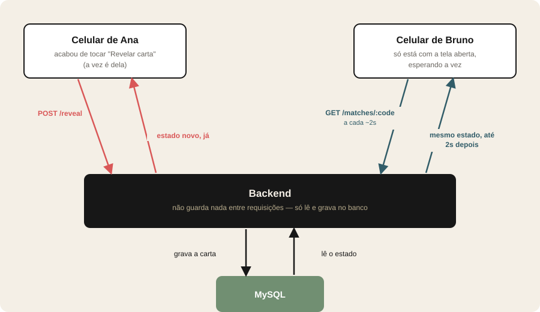

# Drink Game

Jogo de cartas para festas com um baralho de 52 cartas de verdade — cada carta
tem um desafio ligado ao valor (perguntas, rimas, categorias, regras da casa
no Rei, e assim por diante).

Comecei como projeto pessoal e resolvi abrir o código. Se curtir a ideia e
quiser ajudar a evoluir, tem um roteiro de issues de segurança e arquitetura
esperando — é só mandar um PR.

Dá pra jogar de duas formas:

- **Local** — um celular só, passando de mão em mão.
- **Em grupo** — cada jogador entra pelo próprio celular usando um link, com
  as telas sincronizadas em tempo real.

## Mecânicas do jogo

- **Baralho sem repetição** — as 52 cartas são embaralhadas uma vez por
  partida e não repetem até acabarem; quando acabam, reembaralha e continua.
- **Regra da casa** — quando sai um Rei, o jogador da vez cria uma regra nova
  de texto livre, válida até o fim da rodada (limpa automaticamente quando a
  rodada vira).
- **Combo de naipe** — quando duas cartas seguidas caem no mesmo naipe, a
  regra da carta atual dobra automaticamente (mostrado como um selo na tela).
- **Shot roulette** — a cada 3 minutos alguém é sorteado aleatoriamente pra
  dar um shot; o aviso aparece ao mesmo tempo em todos os celulares da
  partida, e qualquer um pode reconhecer pra reiniciar a contagem.
- **Controles do host** — quem cria a partida ganha um token de anfitrião que
  permite remover um jogador (`kick`) ou encerrar a partida pra todo mundo a
  qualquer momento.
- **Sala de espera** — cada jogador digita o próprio nome ao entrar pelo
  link; o host compartilha o link (ou usa o compartilhamento nativo do
  celular) e só consegue iniciar quando há pelo menos 2 jogadores.

## Arquitetura

### Ideia central: o navegador nunca é dono do estado

Todo o estado de uma partida — jogador da vez, carta revelada, baralho já
sorteado, regra da casa, contagem do shot — vive **inteiramente no backend**
(MySQL via Prisma). Nenhuma lógica de jogo roda só no cliente. Isso é o que
permite várias pessoas jogarem a mesma partida de celulares diferentes: cada
dispositivo (inclusive o de quem só está assistindo) faz *polling* de
`GET /api/matches/:code` a cada ~2s e renderiza exatamente o que o servidor
devolve. Uma ação (revelar carta, avançar turno) primeiro atualiza o próprio
dispositivo de forma otimista com a resposta da sua chamada, e o polling dos
outros dispositivos alcança em até ~2s.



Como consequência disso, o **backend não guarda nada em memória entre
requisições** — nem sessão, nem timer, nem cache. Até o sorteio do shot
roulette é resolvido com um `UPDATE` atômico condicional no MySQL
(`WHERE pendingShotPlayerId IS NULL`), disparado como efeito colateral de
qualquer `GET`, em vez de um `setTimeout` guardado em algum lugar do
processo. Isso deixa o backend efetivamente sem estado por requisição —
importante pra quem for mexer na arquitetura (ver nota sobre o servidor,
abaixo).

### Modelo de dados (`backend/prisma/schema.prisma`)

| Model | O que representa |
|---|---|
| `Match` | Uma partida: código (chave primária, também o link de convite), status (`WAITING`/`IN_PROGRESS`/`FINISHED`), turno atual, regra da casa, token do host, estado do timer do shot. |
| `Player` | Um jogador dentro de uma partida: nome, ordem de turno, token próprio. |
| `Card` | As 52 cartas fixas do baralho (naipe, valor, texto da regra) — a mesma tabela é reaproveitada por todas as partidas. |
| `MatchDeckCard` | A instância embaralhada do baralho pra uma partida específica: qual carta está em qual posição, se já foi sorteada. |

### Autenticação — deliberadamente simples

Não existe login. Cada jogador ganha um token aleatório
(`crypto.randomBytes`) ao entrar, guardado só no `localStorage` do próprio
aparelho, enviado no header `X-Player-Token` nas ações que exigem ser "sua
vez". O host tem um token equivalente. Isso não é autenticação de verdade —
é o suficiente pra impedir que um celular mexa na vez de outro sem querer.
**O código da partida (6 caracteres) é o controle de acesso real**: quem tem
o link, entra. Isso está documentado como ponto de atenção nas issues de
segurança abertas no repositório.

### Tecnologias

| Camada | Stack |
|---|---|
| Frontend | React 19 + TypeScript + Vite (SPA, sem framework de rotas — 3 telas controladas por estado) |
| Backend | Node + TypeScript + Express + Prisma ORM |
| Banco | MySQL |
| Deploy frontend | Cloudflare Workers (assets estáticos) |
| Deploy backend | Servidor próprio (ver seção de infraestrutura abaixo) |

### Estrutura de pastas

```
backend/
  src/
    index.ts            # bootstrap do Express (CORS, JSON, error handler)
    routes/matches.ts    # as 9 rotas da API + toda a lógica de jogo (ver nota abaixo)
    lib/
      prisma.ts          # cliente Prisma (singleton)
      token.ts           # geração de token de jogador/host (crypto.randomBytes)
      code.ts             # geração do código da partida
      asyncHandler.ts     # wrapper pra rotas async no Express 4
  prisma/
    schema.prisma        # os 4 models acima
    seed.ts               # popula a tabela Card com as 52 cartas e suas regras

frontend/
  src/
    App.tsx               # componente principal — as 3 telas, todos os handlers e efeitos
    api/
      client.ts           # wrapper de fetch pra cada endpoint
      types.ts             # tipos do estado da partida
    components/
      PlayingCard.tsx       # a carta (frente/verso, flip 3D, brasão)
      HostPanel.tsx          # painel de controles do host (kick/encerrar)
      HowToPlayModal.tsx      # modal "como jogar"
    lib/
      identity.ts           # tokens guardados no localStorage
      sound.ts                # efeito sonoro do alerta de shot
```

> **Nota:** `backend/src/routes/matches.ts` (500+ linhas) e `frontend/src/App.tsx`
> (700+ linhas) concentram bastante responsabilidade cada um hoje — são
> "arquivos-deus" conhecidos, já documentados como issues de arquitetura no
> repositório (separar em camada de serviço / hooks). Não é um problema de
> correção, é um problema de organização pra quem for contribuir.

### Endpoints da API

Todos sob `/api/matches`, retornando o estado completo da partida no corpo
da resposta (exceto onde indicado):

| Rota | O que faz | Autenticação |
|---|---|---|
| `POST /` | Cria uma partida, devolve o código e o token de host | — |
| `GET /:code` | Estado atual (usado no load inicial e no polling) | — |
| `POST /:code/join` | Entra na sala com um nome, devolve o token do jogador | — |
| `POST /:code/start` | Embaralha o baralho e começa a partida | host |
| `POST /:code/reveal` | Sorteia a próxima carta pro jogador da vez | jogador da vez |
| `POST /:code/house-rule` | Salva a regra da casa (carta = Rei) | jogador da vez |
| `POST /:code/advance` | Passa a vez pro próximo jogador | jogador da vez ou host |
| `POST /:code/shot/ack` | Reconhece o alerta de shot e reinicia o timer | qualquer um |
| `POST /:code/kick` | Remove um jogador da partida | host |
| `POST /:code/end` | Encerra a partida pra todo mundo | host |

## Infraestrutura de produção — leia antes de propor mudanças pesadas

O backend **não roda numa nuvem elástica** — roda num notebook físico (um
Aspire E1-431 antigo) reaproveitado como servidor Ubuntu, na casa do
mantenedor. Isso importa pra quem for propor mudanças de arquitetura:

- **Recursos são limitados de verdade** — não é uma VM que escala sozinha.
  Antes de sugerir algo como um serviço adicional (Redis, fila de mensagens,
  múltiplos containers, um segundo banco), pense se o ganho compensa rodar
  isso permanentemente num hardware doméstico.
- **Acesso público sem port-forward** — o notebook fica atrás de NAT
  doméstico normal; o acesso público HTTPS vem do
  [Tailscale Funnel](https://tailscale.com/kb/1223/funnel), que expõe a
  porta 80 do servidor via um domínio `*.ts.net` com TLS automático. Não há
  IP público fixo nem configuração de roteador envolvida.
- **Uma única instância** — nginx (porta 80, proxy reverso de `/api/` pro
  Node em `:3000`, e serve o build estático do frontend) → backend Node
  rodando como serviço `systemd` (`drink-game-backend`) → MySQL num
  container Docker local. Sem load balancer, sem réplica.
- **Deploy é só git push** — o workflow do GitHub Actions
  (`.github/workflows/deploy-backend.yml`) conecta na rede Tailscale do
  servidor via SSH e roda `prisma db push` + restart do serviço a cada push
  em `main`. Não existe passo manual.

Isso não significa que o projeto não possa evoluir — só que qualquer PR que
mude a infraestrutura (não só o código da aplicação) deveria ser discutida
numa issue antes, já que precisa rodar de verdade nesse hardware específico,
não só "funcionar em teoria".

## Rodando localmente

### 1. Banco de dados

Suba um MySQL local (ou Docker) e crie o banco:

```bash
mysql -u root -p -e "CREATE DATABASE drink_game; CREATE USER 'drinkgame'@'localhost' IDENTIFIED BY 'changeme'; GRANT ALL ON drink_game.* TO 'drinkgame'@'localhost';"
```

### 2. Backend

```bash
cd backend
cp .env.example .env   # ajuste DATABASE_URL se necessário
npm install
npx prisma db push     # cria as tabelas a partir do schema (sem histórico de migração)
npm run prisma:seed
npm run dev
```

API sobe em `http://localhost:3000`.

### 3. Frontend

```bash
cd frontend
cp .env.example .env
npm install
npm run dev
```

SPA sobe em `http://localhost:5173`.

## Deploy

- **Backend** — GitHub Actions builda e publica no push pra `main`, conectando
  na rede privada do servidor via Tailscale e rodando `prisma db push` +
  restart do serviço (ver seção de infraestrutura acima pro contexto completo).
- **Frontend** — Cloudflare Workers builda automaticamente a partir do mesmo
  push, servindo o build estático do Vite.

Nenhum segredo fica no repositório — as credenciais de deploy (chave SSH,
host, tokens do Tailscale) ficam em GitHub Actions secrets.

## Quer contribuir?

Há issues abertas documentando pontos conhecidos de segurança e arquitetura
— desde correções pequenas e isoladas até refatorações maiores. É um bom
lugar pra começar: cada issue já traz o problema, por que importa, e uma
sugestão de correção.

## Licença

[MIT](LICENSE)
